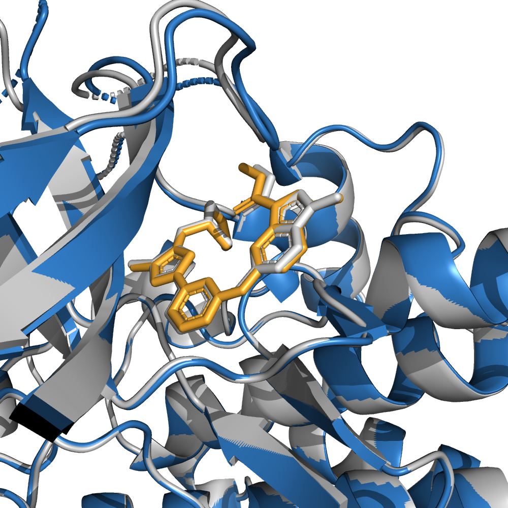

# Biomolecular Structure Prediction with HelixFold3: Replicating the Capabilities of AlphaFold3

The AlphaFold series has transformed protein structure prediction with remarkable accuracy, often matching experimental methods. While AlphaFold2 and AlphaFold-Multimer are open-sourced, facilitating rapid and reliable predictions, [AlphaFold3](https://doi.org/10.1038/s41586-024-07487-w) remains partially accessible and has not been open-sourced, restricting further development.

The PaddleHelix team is working on [HelixFold3](./helixfold3_report.pdf) to replicate the advanced capabilities of AlphaFold3. Insights from the AlphaFold3 paper inform our approach and build on our prior work with [HelixFold](https://arxiv.org/abs/2207.05477), [HelixFold-Single](https://doi.org/10.1038/s42256-023-00721-6), [HelixFold-Multimer](https://arxiv.org/abs/2404.10260), and [HelixDock](https://arxiv.org/abs/2310.13913). Currently, HelixFold3's accuracy in predicting the structures of small molecule ligands, nucleic acids (including DNA and RNA), and proteins is comparable to that of AlphaFold3. We are committed to continuously enhancing the model's performance and rigorously evaluating it across a broader range of biological molecules. Please refer to our [HelixFold3 technical report](./helixfold3_report.pdf) for more details.


<!--  -->


<!-- <p align="center"> -->


<br></br>


<br>


## HelixFold3 Inference

### Environment
Specific environment settings are required to reproduce the results reported in this repo,

* Python: 3.9
* CUDA: 12.0
* CuDNN: 8.4.0
* NCCL: 2.14.3
* Paddle: 2.6.1

Those settings are recommended as they are the same as we used in our A100 machines for all inference experiments. 

### Installation

HelixFold3 depends on [PaddlePaddle](https://github.com/paddlepaddle/paddle). Python dependencies available through `pip` 
is provided with `pyproject.toml`. `kalign`, the [`HH-suite`](https://github.com/soedinglab/hh-suite) and `jackhmmer` are 
also needed to produce multiple sequence alignments. The download scripts require `aria2c`. 

Locate to the directory of `helixfold` then run:

```bash
# Install py env
conda create -n helixfold -c conda-forge python=3.9

# activate the conda environment
conda activate helixfold

# adjust these version numbers as your situation
conda install -y cudnn=8.4.1 cudatoolkit=11.7 nccl=2.14.3 -c conda-forge -c nvidia
conda install -y -c bioconda aria2 hmmer==3.3.2 kalign2==2.04 hhsuite==3.3.0 
conda install -y -c conda-forge openbabel

# install paddlepaddle
pip install paddlepaddle-gpu==2.6.1.post120 -f https://www.paddlepaddle.org.cn/whl/linux/mkl/avx/stable.html
# or lower version: https://paddle-wheel.bj.bcebos.com/2.5.1/linux/linux-gpu-cuda11.7-cudnn8.4.1-mkl-gcc8.2-avx/paddlepaddle_gpu-2.5.1.post117-cp39-cp39-linux_x86_64.whl

# downgrade pip
pip install --upgrade 'pip<24'

# edit configuration file at `./helixfold/config/helixfold.yaml` to set your databases and binaries correctly.

# install HF3 as a python library
pip install .  --no-cache-dir
```

Note: If you have a different version of python3 and cuda, please refer to [here](https://www.paddlepaddle.org.cn/whl/linux/gpu/develop.html) for the compatible PaddlePaddle `dev` package.


#### Install Maxit
The conversion between `.cif` and `.pdb` relies on [Maxit](https://sw-tools.rcsb.org/apps/MAXIT/index.html). 
Download Maxit source code from https://sw-tools.rcsb.org/apps/MAXIT/maxit-v11.100-prod-src.tar.gz. Untar and follow 
its `README` to complete installation. If you encouter error like your GCC version not support (9.4.0, for example), editing `etc/platform.sh` and reruning compilation again would make sense. See below:

```bash
#   Check if it is a Linux platform
    Linux)
#     Check if it is GCC version 4.x
      gcc_ver=`gcc --version | grep -e " 4\."` # edit `4\.` to `9\.`
      if [[ -z $gcc_ver ]]
```

### Usage

In order to run HelixFold3, the genetic databases and model parameters are required.

The parameters of HelixFold3 can be downloaded [here](https://paddlehelix.bd.bcebos.com/HelixFold3/params/HelixFold3-params-240814.zip), 
please place the downloaded checkpoint path in `weight_path` of `helixfold/config/helixfold.yaml` configuration file before install HF3 as a python module.

The script `scripts/download_all_data.sh` can be used to download and set up all genetic databases with the following configs:

*   By default:

    ```bash
    scripts/download_all_data.sh ./data
    ```

   will download the complete databases. The total download size for the complete databases is around 415 GB, 
   and the total size when unzipped is 2.2 TB.  

*   With `reduced_dbs`:

    ```bash
    scripts/download_all_data.sh ./data reduced_dbs
    ```

    will download a reduced version of the databases to be used with the `reduced_dbs` preset. The total download 
    size for the reduced databases is around 190 GB, and the total unzipped size is around 530 GB.

#### Understanding Model Input

There are some demo input under `./data/` for your test and reference. Data input is in the form of JSON containing
several entities such as `protein`, `ligand`, `nucleic acids`, and `iron`. Proteins and nucleic acids inputs are their sequence.
HelixFold3 supports input ligand as SMILES, CCD id or small molecule files, please refer to `/data/demo_6zcy_smiles.json` and `data/demo_p450_heme_sdf.json` 
for more details about SMILES input. Flexible input from small molecule is now supported. See `obabel -L formats |grep -v 'Write-only'`

A example of input data is as follows:

```json
{
    "entities": [
        {
            "type": "protein",
            "sequence": "MDTEVYESPYADPEEIRPKEVYLDRKLLTLEDKELGSGNFGTVKKGYYQMKKVVKTVAVKILKNEANDPALKDELLAEANVMQQLDNPYIVRMIGICEAESWMLVMEMAELGPLNKYLQQNRHVKDKNIIELVHQVSMGMKYLEESNFVHRDLAARNVLLVTQHYAKISDFGLSKALRADENYYKAQTHGKWPVKWYAPECINYYKFSSKSDVWSFGVLMWEAFSYGQKPYRGMKGSEVTAMLEKGERMGCPAGCPREMYDLMNLCWTYDVENRPGFAAVELRLRNYYYDVVNHHHHHH",
            "count": 1
        },
        {
            "type": "ligand",
            "ccd": "QF8",
            "count": 1
        }
    ]
}
```

Another example of **covalently modified** input:

```json
{
    "entities": [
        {
            "type": "protein",
            "sequence": "MDALYKSTVAKFNEVIQLDCSTEFFSIALSSIAGILLLLLLFRSKRHSSLKLPPGKLGIPFIGESFIFLRALRSNSLEQFFDERVKKFGLVFKTSLIGHPTVVLCGPAGNRLILSNEEKLVQMSWPAQFMKLMGENSVATRRGEDHIVMRSALAGFFGPGALQSYIGKMNTEIQSHINEKWKGKDEVNVLPLVRELVFNISAILFFNIYDKQEQDRLHKLLETILVGSFALPIDLPGFGFHRALQGRAKLNKIMLSLIKKRKEDLQSGSATATQDLLSVLLTFRDDKGTPLTNDEILDNFSSLLHASYDTTTSPMALIFKLLSSNPECYQKVVQEQLEILSNKEEGEEITWKDLKAMKYTWQVAQETLRMFPPVFGTFRKAITDIQYDGYTIPKGWKLLWTTYSTHPKDLYFNEPEKFMPSRFDQEGKHVAPYTFLPFGGGQRSCVGWEFSKMEILLFVHHFVKTFSSYTPVDPDEKISGDPLPPLPSKGFSIKLFPRP",
            "count": 1
        },
        {
            "type": "ligand",
            "ccd": "HEM",
            "count": 1
        },
        {
            "type": "ligand",
            "smiles": "CC1=C2CC[C@@]3(CCCC(=C)[C@H]3C[C@@H](C2(C)C)CC1)C",
            "count": 1
        },
        {
            "type": "bond",
            "bond": "A,CYS,445,SG,B,HEM,1,FE,covale,2.3",
            "_comment": "<chain-id>,<residue name>,<residue index>,<atom id>,<chain-id>,<residue name>,<residue index>,<atom id>,<bond type>,<bond length>",
            "_another_comment": "use semicolon to separate multiple bonds",
            "_also_comment": "For ccd input, use CCD key as residue name; for smiles and file input, use `UNK-<index>` where index is the chain order you input. eg. `UNK-1` for the first ligand chain(or the count #1), `UNK-2` the second(or the count #2)."
        }
    ]
}
```
**The atom ID that bonded in covalent bond input is fatal.**
For seaking all atom ids in CCD database:

```shell
helixfold_check_ligand +ligand=HEM
```

This command outputs like the following:

```text
[2024-08-31 10:55:10,131][absl][WARNING] - Using resolved obabel: /mnt/data/envs/conda_env/envs/helixfold/bin/obabel
[2024-08-31 10:55:10,132][absl][INFO] - Started Loading CCD dataset from /mnt/db/ccd/ccd_preprocessed_etkdg.pkl.gz
[2024-08-31 10:55:18,752][absl][INFO] - Finished Loading CCD dataset from /mnt/db/ccd/ccd_preprocessed_etkdg.pkl.gz in 8.620 seconds
[2024-08-31 10:55:18,752][absl][INFO] - CCD dataset contains 43488 entries.
[2024-08-31 10:55:18,752][absl][INFO] - Atoms in HEM: ['CHA', 'CHB', 'CHC', 'CHD', 'C1A', 'C2A', 'C3A', 'C4A', 'CMA', 'CAA', 'CBA', 'CGA', 'O1A', 'O2A', 'C1B', 'C2B', 'C3B', 'C4B', 'CMB', 'CAB', 'CBB', 'C1C', 'C2C', 'C3C', 'C4C', 'CMC', 'CAC', 'CBC', 'C1D', 'C2D', 'C3D', 'C4D', 'CMD', 'CAD', 'CBD', 'CGD', 'O1D', 'O2D', 'NA', 'NB', 'NC', 'ND', 'FE']
```

For seaking all atom ids in a given `sdf`/`mol2`/`smiles`:

```shell
# smiles
helixfold_check_ligand '+ligand="CNC(=O)c1nn(C)c2ccc(Nc3nccc(n3)n4cc(N[C@@H]5CCNC5)c(C)n4)cc12"'

# sdf file
helixfold_check_ligand +ligand=./60119277-3d.sdf

# mol2 file
helixfold_check_ligand +ligand=./60119277-3d.mol2
```

HF3 will output like the following:

```text
helixfold_check_ligand '+ligand="CNC(=O)c1nn(C)c2ccc(Nc3nccc(n3)n4cc(N[C@@H]5CCNC5)c(C)n4)cc12"'
[2024-08-31 10:56:16,445][absl][WARNING] - Using resolved obabel: /mnt/data/envs/conda_env/envs/helixfold/bin/obabel
[2024-08-31 10:56:16,445][absl][INFO] - Guessed ligand input type: smiles
[2024-08-31 10:56:16,567][absl][INFO] - Started converting smiles to mol2: CNC(=O)c1nn(C)c2ccc(Nc3nccc(n3)n4cc(N[C@@H]5CCNC5)c(C)n4)cc12
[2024-08-31 10:56:16,567][absl][WARNING] - This takes a while ...
[2024-08-31 10:56:16,851][absl][INFO] - Finished converting smiles to mol2: CNC(=O)c1nn(C)c2ccc(Nc3nccc(n3)n4cc(N[C@@H]5CCNC5)c(C)n4)cc12 in 0.283 seconds
[2024-08-31 10:56:16,857][absl][INFO] - Atoms in CNC(=O)c1nn(C)c2ccc(Nc3nccc(n3)n4cc(N[C@@H]5CCNC5)c(C)n4)cc12 (smiles): {'UNK-': {'atom_symbol': ['C', 'N', 'C', 'O', 'C', 'N', 'N', 'C', 'C', 'C', 'C', 'C', 'N', 'C', 'N', 'C', 'C', 'C', 'N', 'N', 'C', 'C', 'N', 'C', 'C', 'C', 'N', 'C', 'C', 'C', 'N', 'C', 'C'], 'charge': [0, 0, 0, 0, 0, 0, 1, 0, 0, 0, 0, 0, 0, 0, 0, 0, 0, 0, 0, 1, 0, 0, 0, 0, 0, 0, 0, 0, 0, 0, 0, 0, 0], 'atom_ids': ['C1', 'N1', 'C2', 'O1', 'C3', 'N2', 'N3', 'C4', 'C5', 'C6', 'C7', 'C8', 'N4', 'C9', 'N5', 'C10', 'C11', 'C12', 'N6', 'N7', 'C13', 'C14', 'N8', 'C15', 'C16', 'C17', 'N9', 'C18', 'C19', 'C20', 'N10', 'C21', 'C22'], 'coval_bonds': [('C1', 'N1', 'SING'), ('N1', 'C2', 'SING'), ('C2', 'O1', 'DOUB'), ('C2', 'C3', 'SING'), ('C3', 'N2', 'AROM'), ('N2', 'N3', 'AROM'), ('N3', 'C4', 'SING'), ('N3', 'C5', 'AROM'), ('C5', 'C6', 'AROM'), ('C6', 'C7', 'AROM'), ('C7', 'C8', 'AROM'), ('C8', 'N4', 'SING'), ('N4', 'C9', 'SING'), ('C9', 'N5', 'AROM'), ('N5', 'C10', 'AROM'), ('C10', 'C11', 'AROM'), ('C11', 'C12', 'AROM'), ('C12', 'N6', 'AROM'), ('C9', 'N6', 'AROM'), ('C12', 'N7', 'SING'), ('N7', 'C13', 'AROM'), ('C13', 'C14', 'AROM'), ('C14', 'N8', 'SING'), ('N8', 'C15', 'SING'), ('C15', 'C16', 'SING'), ('C16', 'C17', 'SING'), ('C17', 'N9', 'SING'), ('N9', 'C18', 'SING'), ('C15', 'C18', 'SING'), ('C14', 'C19', 'AROM'), ('C19', 'C20', 'SING'), ('C19', 'N10', 'AROM'), ('N7', 'N10', 'AROM'), ('C8', 'C21', 'AROM'), ('C21', 'C22', 'AROM'), ('C3', 'C22', 'AROM'), ('C5', 'C22', 'AROM')], 'position': array([[  2.8929,  -1.0132,   1.1086],
       [  3.7391,  -1.0171,  -0.0475],
       [  4.0952,   0.1618,  -0.6747],
       [  3.7451,   1.2639,  -0.2632],
       [  4.9273,  -0.0255,  -1.8697],
       [  5.2505,  -1.2502,  -2.3477],
       [  6.0037,  -0.9802,  -3.4344],
       [  6.4721,  -2.0524,  -4.2816],
       [  6.2059,   0.3548,  -3.6608],
       [  6.918 ,   1.0385,  -4.6439],
       [  6.8886,   2.4361,  -4.5918],
       [  6.2178,   3.1502,  -3.589 ],
       [  6.223 ,   4.5552,  -3.5106],
       [  7.2064,   5.4461,  -3.9552],
       [  7.2928,   6.6137,  -3.3032],
       [  8.3377,   7.4081,  -3.6083],
       [  9.3053,   7.0807,  -4.5284],
       [  9.1092,   5.8865,  -5.1784],
       [  8.0557,   5.0867,  -4.9217],
       [ 10.0465,   5.4369,  -6.1549],
       [  9.8984,   4.3439,  -6.9834],
       [ 10.9956,   4.3038,  -7.8014],
       [ 11.2377,   3.4349,  -8.8185],
       [ 10.147 ,   2.7603,  -9.5397],
       [ 10.643 ,   1.4653, -10.1679],
       [ 11.0877,   1.8617, -11.5619],
       [ 10.2177,   2.9614, -11.9789],
       [  9.6687,   3.5755, -10.7532],
       [ 11.8347,   5.3372,  -7.3132],
       [ 13.2229,   5.6823,  -7.7052],
       [ 11.2358,   6.0634,  -6.3575],
       [  5.4856,   2.4209,  -2.6404],
       [  5.4943,   1.0102,  -2.6657]], dtype=float32)}}
```

`atom_ids` is what we are looking for.

#### Running HelixFold for Inference

To run inference on a sequence or multiple sequences using HelixFold3's pretrained parameters, run e.g.:

##### Run from default config

```shell
LD_LIBRARY_PATH=$CONDA_PREFIX/lib/:$LD_LIBRARY_PATH \
helixfold \
    input=./data/demo_8ecx.json \
    output=. \
    CONFIG_DIFFS.preset=allatom_demo
```

##### Run with customized configuration dir and file(`./myfold.yaml`, for example):

```shell
LD_LIBRARY_PATH=$CONDA_PREFIX/lib/:$LD_LIBRARY_PATH \
helixfold --config-dir=. --config-name=myfold \
    input=./data/demo_6zcy_smiles.json \
    output=. \
    CONFIG_DIFFS.preset=allatom_demo
```

##### Run with additional configuration term 

```shell
LD_LIBRARY_PATH=$CONDA_PREFIX/lib/:$LD_LIBRARY_PATH \
helixfold \
    input=./data/demo_6zcy.json \
    output=. \
    CONFIG_DIFFS.preset=allatom_demo \
    +CONFIG_DIFFS.model.global_config.subbatch_size=192 \
    +CONFIG_DIFFS.model.num_recycle=10
```

The descriptions of the above script are as follows:
* `LD_LIBRARY_PATH` - This is required to load the `libcudnn.so` library if you encounter issue like `RuntimeError: (PreconditionNotMet) Cannot load cudnn shared library. Cannot invoke method cudnnGetVersion.`
* `config-dir` - The directory that contains the alterative configuration file you would like to use.
* `config-name` - The name of the configuration file you would like to use.
* `input` - Input data in the form of JSON or directory that contains such JSON file(s). For file input, check content pattern in `./data/demo_*.json` for your reference.
* `output` - Model output path. The output will be in a folder named the same as your input json file under this path.
* `CONFIG_DIFFS.preset` - Adjusted model config preset name in `./helixfold/model/config.py:CONFIG_DIFFS`. The preset will be updated into final model configuration with `CONFIG_ALLATOM`.
* `CONFIG_DIFFS.*` - Override model any configuration in `CONFIG_ALLATOM`.

### Understanding Model Output

The outputs will be in a subfolder of `output_dir`, including the computed MSAs, predicted structures, 
ranked structures, and evaluation metrics. For a task of inferring twice with diffusion batch size 3, 
assume your input JSON is named `demo_data.json`, the `output_dir` directory will have the following structure:

```text
<output_dir>/
└── demo_data/
    ├── demo_data-pred-1-1/
    │   ├── all_results.json
    │   ├── predicted_structure.pdb
    │   └── predicted_structure.cif
    ├── demo_data-pred-1-2/
    ├── demo_data-pred-1-3/
    ├── demo_data-pred-2-1/
    ├── demo_data-pred-2-2/
    ├── demo_data-pred-2-3/
    |
    ├── demo_data-rank[1-6]/
    │   ├── all_results.json
    |   ├── predicted_structure.pdb
    │   └── predicted_structure.cif  
    |
    ├── final_features.pkl
    └── msas/
        ├── ...
        └── ...

```

The contents of each output file are as follows:
* `final_features.pkl` – A `pickle` file containing the input feature NumPy arrays
 used by the models to predict the structures. If you need to re-run a inference without re-building the MSAs, delete this file.
* `msas/` - A directory containing the files describing the various genetic
 tool hits that were used to construct the input MSA.
* `demo_data-pred-X-Y` - Prediction results of `demo_data.json` in X-th inference and Y-thdiffusion batch, 
including predicted structures in `cif` or `pdb` and a JSON file containing all metrics' results.
* `demo_data-rank*` - Ranked results of a series of predictions according to metrics.

### Resource Usage

We suggest a single GPU for inference has at least 32G available memory. The maximum number of tokens is around 
1200 for inference on a single A100-40G GPU with precision `bf16`. The length of inference input tokens on a 
single V100-32G with precision `fp32` is up to 1000. Inferring longer tokens or entities with larger atom numbers 
per token than normal protein residues like nucleic acids may cost more GPU memory.

For samples with larger tokens, you can override `model.global_config.subbatch_size` in `CONFIG_ALLATOM` by using `+CONFIG_DIFFS.model.global_config.subbatch_size=X` on command runs, where `X` is a smaller number than `96`, to save more GPU memory although this will cause a slower inference. Additionally, you can reduce the number of additional recycles by setting `+CONFIG_DIFFS.model.num_recycle=Y`, where `Y` is a smaller number than `3`.


We are keen on support longer token inference, it will come in soon.


## Copyright

HelixFold3's code and model parameters are available under the [Creative Commons Attribution-NonCommercial-ShareAlike 4.0 International License](https://creativecommons.org/licenses/by-nc-sa/4.0/),  license for non-commercial use by individuals or non-commercial organizations only. Please check the details in [LICENSE](./LICENSE) before using HelixFold3.

## Reference

[1]  Abramson, J et al. (2024). Accurate structure prediction of biomolecular interactions with AlphaFold 3. Nature 630, 493–500. 10.1038/s41586-024-07487-w

[2] Jumper J, Evans R, Pritzel A, et al. (2021). Highly accurate protein structure prediction with AlphaFold. Nature 577 (7792), 583–589. 10.1038/s41586-021-03819-2.

[3] Evans, R. et al. (2022). Protein complex prediction with AlphaFold-Multimer. Preprint at bioRxiv https://doi.org/10.1101/2021.10.04.463034

[4]  Guoxia Wang, Xiaomin Fang, Zhihua Wu, Yiqun Liu, Yang Xue, Yingfei Xiang, Dianhai Yu, Fan Wang,
and Yanjun Ma. Helixfold: An efficient implementation of alphafold2 using paddlepaddle. arXiv preprint
arXiv:2207.05477, 2022

[5] Xiaomin Fang, Fan Wang, Lihang Liu, Jingzhou He, Dayong Lin, Yingfei Xiang, Kunrui Zhu, Xiaonan Zhang,
Hua Wu, Hui Li, et al. A method for multiple-sequence-alignment-free protein structure prediction using a protein
language model. Nature Machine Intelligence, 5(10):1087–1096, 2023

[6] Xiaomin Fang, Jie Gao, Jing Hu, Lihang Liu, Yang Xue, Xiaonan Zhang, and Kunrui Zhu. Helixfold-multimer:
Elevating protein complex structure prediction to new heights. arXiv preprint arXiv:2404.10260, 2024.

[7] Lihang Liu, Donglong He, Xianbin Ye, Shanzhuo Zhang, Xiaonan Zhang, Jingbo Zhou, Jun Li, Hua Chai, Fan
Wang, Jingzhou He, et al. Pre-training on large-scale generated docking conformations with helixdock to unlock
the potential of protein-ligand structure prediction models. arXiv preprint arXiv:2310.13913, 2023.

## Citation

If you use the code, data, or checkpoints in this repo, please cite the following:

```bibtex
@article{helixfold3,
  title={Technical Report of HelixFold3 for Biomolecular Structure Prediction},
  author={PaddleHelix Team},
  year={2024}
}
```
